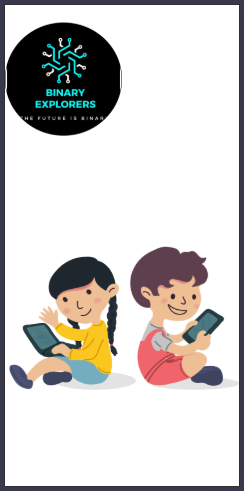
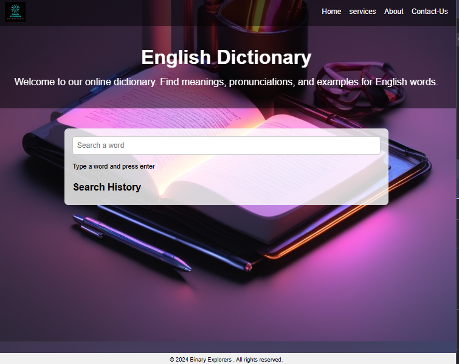

# ProjectXApp - English Dictionary

## 🌐 Live Preview
[

## 📚 About
ProjectXApp is an interactive **English Dictionary** web application designed to help users find word meanings, pronunciations, and example sentences easily. With a user-friendly interface, animated transitions, and a search history feature, it provides a seamless experience for learners and enthusiasts.

## 🎯 Features
- **🔍 Search Functionality:** Users can type a word and get its meaning, example sentences, and pronunciation.
- **🎤 Pronunciation Support:** Audio feature to listen to word pronunciations.
- **📝 Search History:** Stores previously searched words for easy reference.
- **🌟 Animated UI:** Smooth scroll animations for better user experience.
- **📱 Mobile Responsive:** Works seamlessly across different screen sizes.
- **🖼️ Engaging Design:** Custom fonts, icons, and a visually appealing interface.
- **🌍 Navigation Menu:** Easy access to Home, Services, About, and Contact pages.

## 🚀 How to Use
1. **Visit the Live Demo:** [ProjectXApp](https://rajath2005.github.io/ProjectXApp.github.io/)
2. **Search for a Word:** Enter a word in the search bar and press Enter.
3. **View Meaning & Examples:** The app will display the definition, example sentence, and pronunciation.
4. **Listen to Pronunciation:** Click the audio button to hear the correct pronunciation.
5. **Check Search History:** Previous searches are saved for quick reference.
6. **Navigate the Site:** Use the menu to explore other sections like Services and About.

## 🛠️ Technologies Used
- **Frontend:** HTML, CSS, JavaScript
- **Fonts:** Google Fonts (Fugaz One, Basic, Poppins, Nunito)
- **Animations:** CSS Transitions & JavaScript Scroll Animations

## 📂 File Structure
```
ProjectXApp.github.io/
│── index.html         # Main home page
│── index1.html        # Dictionary interface page
│── service.html       # Services section
│── about.html         # About us page
│── contact.html       # Contact information page
│── index1.js          # JavaScript for dictionary functionality
│── global1.css        # Global styles
│── index.css          # Main stylesheet
│── assets/            # Images, icons, and fonts
│── Logo.jpeg          # Website logo
│── arrowbackwardcircle.svg # Skip button icon
```

## 🗄 Screenshots



## 📌 Future Enhancements
- 🔄 **Dark Mode Support**
- 📝 **User Account for Saving Favorites**
- 🌎 **Multi-Language Support**
- 📊 **Word Usage Statistics**

## 🤝 Contributing
Contributions are welcome! If you’d like to improve this project, follow these steps:
1. **Fork the Repository**
2. **Clone the Forked Repo**: `git clone https://github.com/your-username/ProjectXApp.github.io.git`
3. **Create a New Branch**: `git checkout -b feature-branch`
4. **Make Your Changes & Commit**
5. **Push to Your Fork**: `git push origin feature-branch`
6. **Create a Pull Request**

## 📞 Contact
For any queries, feel free to reach out:
- **Email:** rajathajeru@gmail.com
- **GitHub:** [Rajath2005](https://github.com/Rajath2005)
- **Website:** [ProjectXApp](https://rajath2005.github.io/ProjectXApp.github.io/)

---
🚀 **Explore the World of Words with ProjectXApp!** 🚀
